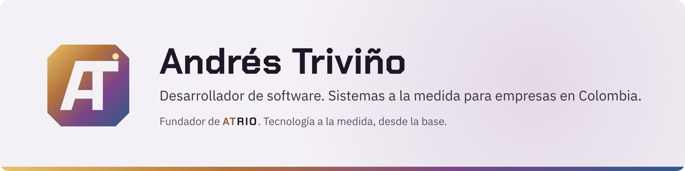
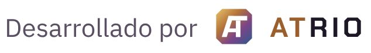

<picture>
  <source media="(prefers-color-scheme: dark)" srcset="assets/banner-oscuro.png">
  
</picture>

### Hola, soy Andrés

Soy desarrollador full stack. Desde 2018 construyo aplicaciones web completas, integro APIs y creo herramientas internas a la medida. Trabajo de forma ordenada, comunico con claridad y me adapto rápido a entornos cambiantes.

Firmo mis proyectos con **Atrio**, mi marca de desarrollo de software: sistemas a la medida para empresas, como inventarios, plataformas web y herramientas internas que se ajustan a cómo trabaja cada negocio.

### Con qué trabajo

### Experiencia

| Rol | Empresa | Periodo |
| --- | --- | --- |
| Ingeniero de Software de Sistemas Senior | Goldfish Group | mar. 2026 – actualidad |
| Desarrollador full stack | Tiqnia Tech Solutions | ene. 2026 – abr. 2026 |
| Desarrollador full stack | FLUVIP – The Influencer Marketing Group | dic. 2021 – oct. 2025 |
| Apoyo de sistemas | Indeportes Quindío | jun. 2021 – oct. 2021 |
| Desarrollador web | Lusuau | sept. 2018 – abr. 2019 |

**Formación:** Tecnólogo en Análisis y Desarrollo de Sistemas de Información, SENA (2015–2017).

### Proyectos destacados

| Proyecto | Qué es |
| --- | --- |
| [easyInventory](https://github.com/andrestrivino1/easyInventory) | Sistema web de inventario, transferencias e importaciones en Laravel |
| [cargo-express](https://github.com/andrestrivino1/cargo-express) | Sistema Laravel para ingreso, citas, portería y almacenamiento de contenedores |
| [api-micro-saas](https://github.com/andrestrivino1/api-micro-saas) | Backend NestJS multi-tenant para SaaS de agenda en peluquería canina |
| [logistics-mvp](https://github.com/andrestrivino1/logistics-mvp) | MVP logístico de cotizaciones y envíos en Laravel |
| [jv-belleza-integral](https://github.com/andrestrivino1/jv-belleza-integral) | Sitio web y sistema interno de citas para salón de belleza |

 

<picture>
  <source media="(prefers-color-scheme: dark)" srcset="assets/firma-oscuro.png">
  
</picture>
